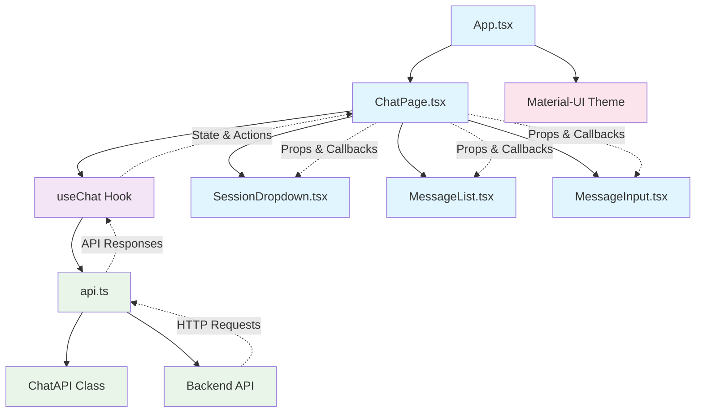

```mermaid
flowchart TD
    A["App.tsx"] --> B["ChatPage.tsx"] & Theme["Material-UI Theme"]
    B --> C["useChat Hook"] & D["SessionDropdown.tsx"] & E["MessageList.tsx"] & F["MessageInput.tsx"]
    C --> G["api.ts"]
    G --> I["ChatAPI Class"] & J["Backend API"]
    J -. HTTP Requests .-> G
    G -. API Responses .-> C
    C -. State & Actions .-> B
    B -. Props & Callbacks .-> D & E & F
     A:::component
     B:::component
     Theme:::external
     C:::hook
     D:::component
     E:::component
     F:::component
     G:::api
     I:::api
     J:::api
    classDef component fill:#e1f5fe
    classDef hook fill:#f3e5f5
    classDef api fill:#e8f5e8
    classDef types fill:#fff3e0
    classDef external fill:#fce4ec
```